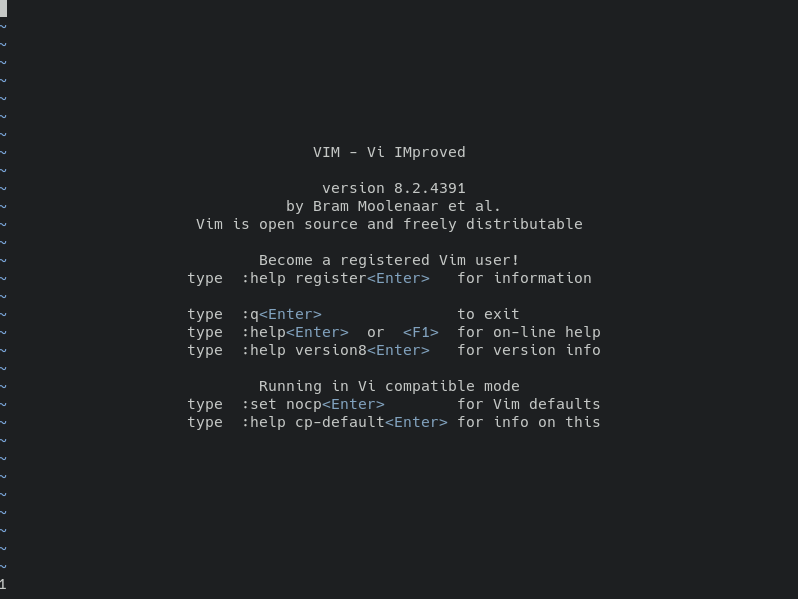
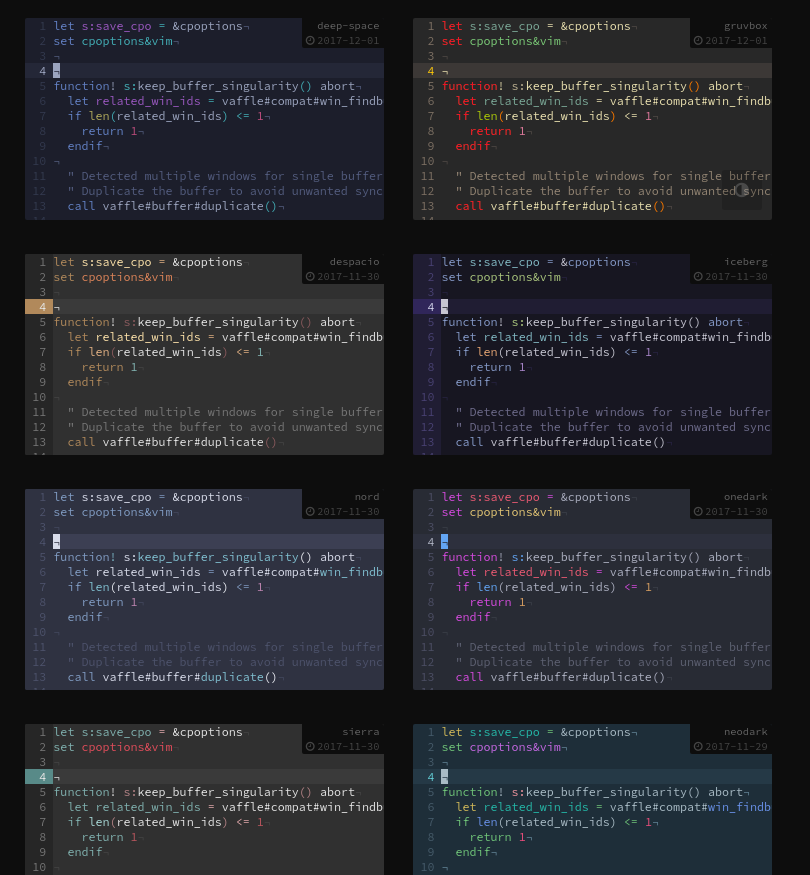
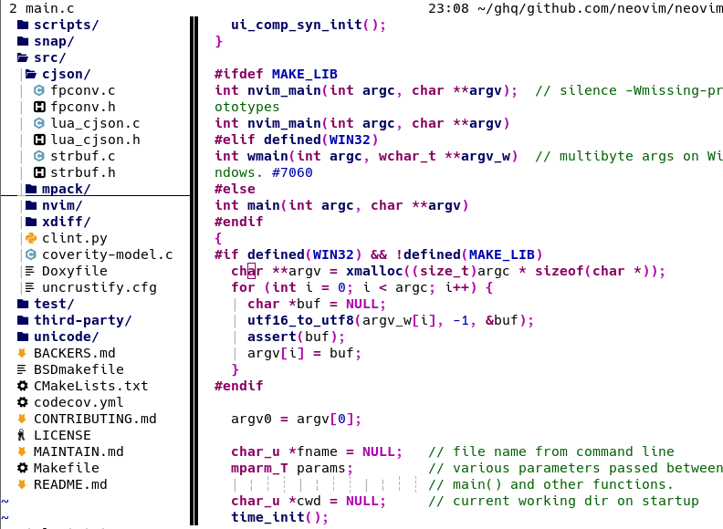
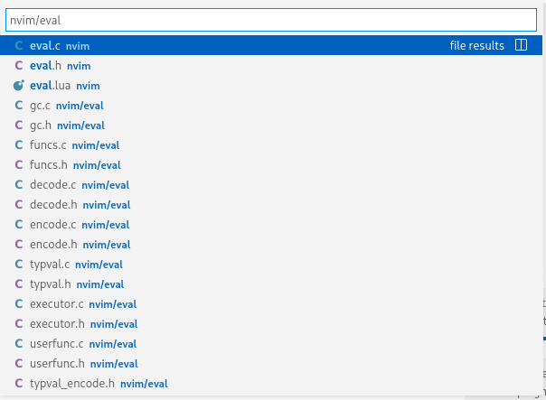
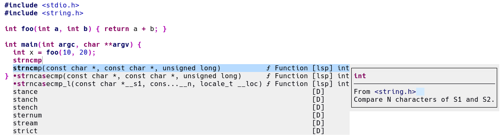
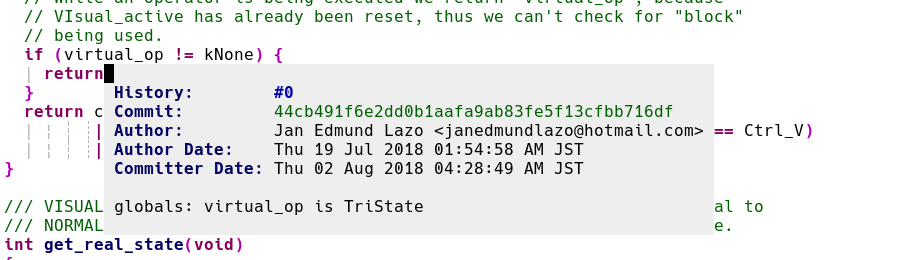

<style>
{
  font-size: 28px;
}
h5 {
  font-size: 15px;
}
</style>

# EEIC Vim Meetup

2022年2月21日
by [matsui54](https://github.com/matsui54)

---


## 目次

- 自己紹介
- VimとNeovim
- プラグインの紹介
- なぜVSCodeではなく、Vimを使うのか

---

## 自己紹介

- 松井晴輝(GitHub ハンドルネーム: [matsui54](https://github.com/matsui54))
- Vim歴: 2年弱
- 使っているエディタ: Neovim
- Vimの設定ファイルの行数: 
  2400以上（コメント・空白行除く）
- Vim関係の活動: 
  - 自作プラグイン開発
  - プラグインへのプルリクエストなど
  - 本体にも関わっていきたい...


[^1]: https://vim-jp.org/vim-users-jp/2009/07/10/Hack-39.html

---

### Vimに抱くイメージ
- 古い
- 不便
- ダサい
- VSCodeでよくね

&rArr; 今日はそのイメージを変えたい...!


---

## Vimのイメージその1 ダサい


---

### 視覚に訴えるプラグイン
- デフォルトの色は確かに微妙
&rArr; カラースキーム
<!--  -->


#### カラースキーム
- [iceberg](https://github.com/cocopon/iceberg.vim): コントラスト低め
- [gruvbox-material](https://github.com/sainnhe/gruvbox-material)
- [solarized](https://github.com/altercation/vim-colors-solarized): VSCodeにもあるやつ
- [shirotelin](https://github.com/yasukotelin/shirotelin): 白背景だけど見やすい
- その他たくさん...

[colorswat](https://colorswat.ch/vim/)というサイトで、カラースキームを見比べることができる。

---

#### ステータスライン
編集中のファイル、カレントディレクトリ、Gitブランチなどの情報表示

- [lightline](https://github.com/itchyny/lightline.vim)


##### https://raw.githubusercontent.com/wiki/itchyny/lightline.vim/image/solarized_light.png


---

### ファイルのツリー表示
ディレクトリ構成を俯瞰
- ファイルの移動・削除などの基本操作
- 2画面ファイラー
- 一括リネーム

#### プラグイン
- [defx.nvim](https://github.com/Shougo/defx.nvim)
- [fern.vim](https://github.com/lambdalisue/fern.vim) 初心者におすすめ。



---

### プレビュー付きのファイル検索
- ファジーファインダー
  - [denite.nvim](https://github.com/Shougo/denite.nvim) ddu.vimに開発は移行。設定は難しい。
  - [fzf.vim](https://github.com/junegunn/fzf.vim) 一番有名。
  - [Telescope.nvim](https://github.com/nvim-telescope/telescope.nvim)  Neovim専用

Vimにはファジーファインダーがたくさんあるので、興味のあるかたは[こちらの記事](https://zenn.dev/yutakatay/articles/vim-fuzzy-finder)をどうぞ。



---

### その他視覚に訴えるプラグイン
- [undotree](https://github.com/mbbill/undotree) 変更履歴の一覧表示。
- [calendar.vim](https://github.com/itchyny/calendar.vim) カレンダーを出せる。
- [indentLine](https://github.com/Yggdroot/indentLine) インデントを可視化する。


---

## Vimのイメージその2 不便、IDE的な機能が使えない

---

### Language Server Protocol (LSP)
- 診断
- 定義ジャンプ
- 補完（引数・補完候補のドキュメントの表示）
- シンボル一覧
- 関数のヒントの表示（ホバー）
- コードの整形
- ...

といったIDEが標準的に備えている便利機能をまとめたプロトコルのこと。
このプロトコルはエディタ間で共通。
&rArr; Vim/Emacs等でもLSP クライアントを入れればVSCodeのこれらの便利機能を使えるように!

---

### Language Server Protocol (LSP) (おまけ)

昔は、便利な編集機能（定義ジャンプや関数や変数の補完）は言語ごとに実装され、そのツールごとにエディタが対応する必要があった。

LSPはこれらの便利機能をプロトコルとして定義し、エディタはLSPの仕様を実装すればどの言語のLanguage Serverの機能も使えるようになった。


<!-- _footer: https://code.visualstudio.com/assets/api/language-extensions/language-server-extension-guide/lsp-languages-editors.png -->


---

### VimのLSPクライアント
- [vim-lsp](https://github.com/prabirshrestha/vim-lsp) (Neovimではない) Vimでも動く。
- Neovim builtin LSP: Neovimの組み込みLSPクライアント。動作が速いがLuaで設定する必要あり。[lspconfig](https://github.com/neovim/nvim-lspconfig)が必要。
- [coc.nvim](https://github.com/neoclide/coc.nvim) "Make your Vim/Neovim as smart as VSCode."がモットー。
  初心者におすすめ。自動補完機能も持っている、オールインワンプラグイン。
  Nodejsを入れる必要あり。

---

### 自動補完
ファイル、辞書、周囲の単語などがサジェストされる。
- [ddc.vim](https://github.com/Shougo/ddc.vim) 最強のカスタマイズ性。Denoを入れる必要あり。
- [coc.nvim](https://github.com/neoclide/coc.nvim) 初心者におすすめ。
- [nvim-cmp](https://github.com/hrsh7th/nvim-cmp) Neovimが使うならおすすめ。



---

### スニペット
定型文を挿入してくれる機能。
- [vim-vsnip](https://github.com/hrsh7th/vim-vsnip) スニペット定義はVSCode方式。ミニマルで扱いやすい。
- [ultisnips](https://github.com/SirVer/ultisnips) VSCodeよりもはるかに高機能。

```c
// Cのfor文の例
for (${1:size_t} ${2:i} = ${3:0}; $2 < ${4:length}; $2++) {
  $0
}
```

```tex
% texでよく使うやつ
図\ref{$1}
```

---

### Git操作
- [gina.vim](https://github.com/lambdalisue/gina.vim) Git操作全般。ターミナルに戻らずに直感的に操作できる。
- [git-messanger.vim](https://github.com/rhysd/git-messenger.vim) 行ごとにコミット情報が出せる。



---

### Vimの組み込み機能拡張プラグイン
- [vim-sandwich](https://github.com/machakann/vim-sandwich) ()や""で囲むoperatorを実現する。
- [clever-f](https://github.com/rhysd/clever-f.vim) `f`コマンドを拡張。飛べる文字をハイライトしてくれる。
- [vim-swap](https://github.com/machakann/vim-swap) 関数の引数を一発で入れ替え。

---

### その他便利なプラグイン
- [vim-quickrun](https://github.com/thinca/vim-quickrun) 一発でコンパイル&実行。
- [caw.vim](https://github.com/tyru/caw.vim) コメントアウトプラグイン。
- [vim-tex](https://github.com/lervag/vimtex) texのプレビュー等。
- [skkeleton](https://github.com/vim-skk/skkeleton) 変態的な日本語入力機構である[SKK](https://dic.nicovideo.jp/a/skk)をVimで実現する。IMEを切り換える必要がない。

---

## なぜVSCodeではなく、Vimを使うのか
- マウスを使いたくない (Vim拡張を使ってもマウス操作を強いられることがある) 
- すべてを自分の思い通りにしたい。
  - VSCodeは拡張機能や設定で、ある程度ユーザーの思い通りにすることはできる。
  - しかし、エディタにもとから組込まれている機能については、不要な機能を削ったり、他の拡張に置きかえることはできない。

---

## VimとNeovim
### Vim
- 互換性重視
- どの環境でも入れやすい
- 一応新機能も追加されているが、なんか微妙...


---

### Neovim
- モダンな機能がどんどん追加されている
  ex. LSP（VSCodeのような言語機能）, TreeSitter (よりよいシンタックスハイライト)
- Better defaults
- Lua（Vim scriptよりも数十倍速い）という言語で拡張可能（もちろんVim scriptも動く）


特に理由がなければ、Neovimを使うことをおすすめします。

---

## Vimに興味を持った方へ
まずは[実践Vim](https://www.amazon.co.jp/%E5%AE%9F%E8%B7%B5Vim-%E6%80%9D%E8%80%83%E3%81%AE%E3%82%B9%E3%83%94%E3%83%BC%E3%83%89%E3%81%A7%E7%B7%A8%E9%9B%86%E3%81%97%E3%82%88%E3%81%86%EF%BC%81-%E3%82%A2%E3%82%B9%E3%82%AD%E3%83%BC%E6%9B%B8%E7%B1%8D-%EF%BC%A4%EF%BD%92%EF%BD%85%EF%BD%97-%EF%BC%AE%EF%BD%85%EF%BD%89%EF%BD%8C-ebook/dp/B00HWLJI3U)を読みましょう。
何度か出てきた[coc.nvim](https://github.com/neoclide/coc.nvim)がVSCodeを普段使っている人には抵抗が少ないはず。

### プラグインマネージャ
プラグインを入れてみたい人はこちら
- [vim-plug](https://github.com/junegunn/vim-plug) 簡単でおすすめ
- [dein.vim](https://github.com/Shougo/dein.vim) 起動時間をチューニングしたい人向け

---

#### おすすめ入門記事
「vim プラグイン」とかでGoogle検索上位に出てくるプラグインはすでに古くなっていることも多い...
- [上達したいVim初心者のための設定・プラグインの見つけ方、学び方](https://eh-career.com/engineerhub/entry/2019/01/28/103000) 
  基本的な心構えについて。記事内で言及されているvim-polyglotは現在はおすすめしません。
- [無人島に持っていく(Neo)vimプラグイン10選 (TS開発環境編)](https://zenn.dev/yano/articles/vim_plugin_top_10)
- [Neovim v0.5リリース記念 v0.5の新機能を紹介します【前編】](https://lab.mo-t.com/blog/neovim-v05-introduction-new-features-part-1) 
  Neovimについて知りたい方向け。

---

# :wqall!
